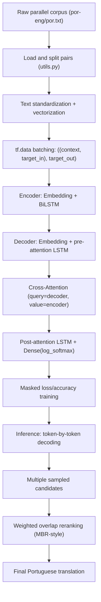

## 1. Project Title
Neural Machine Translation System (English to Portuguese) with LSTM + Attention

## 2. Overview
This project implements an end-to-end Neural Machine Translation (NMT) system that translates English sentences into Portuguese using a sequence-to-sequence architecture with attention.  
It addresses a core NLP problem: learning semantic and syntactic alignment between two languages and generating fluent target-language output token by token.

Why this matters:
- It demonstrates how deep learning models convert raw text into structured numerical representations and back into language.
- It captures real AI engineering concerns: data preprocessing, vectorization, sequence modeling, inference-time decoding, and output selection.
- It includes a probabilistic decoding extension (Minimum Bayes Risk-style selection) to improve robustness beyond greedy generation.

## 3. Features
- Parallel corpus loading from `por-eng/por.txt` (Portuguese-English sentence pairs).
- Text normalization and tokenization using `TextVectorization` with `[SOS]/[EOS]` control tokens.
- Bidirectional LSTM encoder for contextual source representation.
- Decoder with pre-attention LSTM, cross-attention, post-attention LSTM, and vocabulary projection.
- Custom masked loss and masked accuracy for padded sequence training.
- Inference with temperature-based sampling.
- Candidate reranking using weighted overlap scoring (MBR-style decoding).

## 4. Tech Stack
- Python 3
- TensorFlow / Keras
- NumPy
- Pandas (dependency listed; pipeline is primarily TensorFlow + NumPy)
- `tf.data` input pipeline utilities

## 5. Architecture / Workflow


## 6. Project Structure
```text
neural-machine-translation-lstm-attention/
|-- main.py                # Inference entry point + candidate generation + MBR-style selection
|-- training.py            # Model compile/train routine and trained_translator object
|-- translator.py          # Top-level Translator (Encoder + Decoder)
|-- encoder.py             # Encoder layer (Embedding + Bidirectional LSTM)
|-- decoder.py             # Decoder layer with attention and output projection
|-- cross_attention.py     # Cross-attention block (MHA + residual + layer norm)
|-- utils.py               # Data loading, preprocessing, vectorizers, metrics, text utilities
|-- requirements.txt       # Python dependencies
|-- por-eng/
|   `-- por.txt            # Parallel corpus file
`-- README.md
```

## 7. Installation
```bash
git clone https://github.com/TrishamBP/neural-machine-translation-lstm-attention.git
cd neural-machine-translation-lstm-attention
python -m venv .venv
# Windows
.venv\Scripts\activate
# Linux/macOS
source .venv/bin/activate
pip install -r requirements.txt
```

## 8. Usage
This codebase trains and runs in script-driven mode.

Train the model:
```bash
python training.py
```

Run interactive translation:
```bash
python main.py
```

When prompted:
```text
Enter an English sentence to translate:
```

The script will:
1. Generate multiple translation candidates via sampling.
2. Score candidate consistency with overlap-based metrics.
3. Print all candidates and the selected translation.

## 9. Example Output
Illustrative runtime pattern:
```text
Enter an English sentence to translate: How are you?

Translation candidates:
[candidate 1...]
[candidate 2...]
[candidate 3...]
...

Selected translation: [best candidate chosen by weighted overlap]
```

## 10. Engineering Insights
- Modular decomposition: Encoder, Decoder, Attention, and orchestration are isolated into separate files for maintainability and experimentation.
- Data pipeline design: `tf.data` mapping from raw sentence pairs to shifted target tensors supports teacher-forced sequence learning.
- Numerically stable training objective: masked sequence loss excludes padding tokens from optimization and metrics.
- Decoding strategy: temperature sampling introduces diversity; reranking selects high-consensus outputs.
- Trade-off: importing `training.py` triggers training immediately (`trained_translator` is created at import time), which is simple for demos but not ideal for production separation of train vs serve.
- Scalability direction: architecture can evolve toward larger vocabularies, subword tokenization, checkpointing, and service-style inference endpoints.

## 11. Learning Journey & AI/ML Foundations
### A. Computational & Mathematical Foundations
This project reflects a strong foundation in:
- Mathematical modeling of sequence transduction problems.
- Numerical computation over tensors (vectorized operations, masked objectives, probability-space decoding).
- Algorithmic problem-solving through custom decoding/reranking logic.
- Matrix-oriented thinking central to modern ML workflows (embedding spaces, recurrent state transitions, attention operations).
- Structured data processing mindset aligned with practical ETL and tensor pipeline construction.

### B. Current Academic Direction
I am currently pursuing an M.Tech in AI/ML, with focus areas including:
- Machine Learning
- Deep Learning
- Natural Language Processing
- AI Systems Engineering

### C. Self-Driven Learning Narrative
This project is part of my self-driven transition into AI/ML engineering.  
I intentionally build and ship hands-on systems to deepen understanding of model internals, training behavior, and inference-time decision logic rather than treating ML as a black box.

### D. Project -> AI/ML Mapping
- Sequence modeling implementation -> foundation for modern NLP systems.
- Attention mechanism design -> core concept behind scalable neural architectures.
- Numerical decoding/reranking -> practical approximation to decision-theoretic inference.
- Pipeline orchestration -> transferable to production ML systems and backend AI services.

### E. Narrative Positioning
This project is part of my transition into AI/ML, where I apply strong foundations in computational modeling and numerical methods to build scalable and intelligent systems.

### F. Core Insight
Even before specializing in AI/ML, I was working with computational algorithms, numerical methods, and system modeling, which form the backbone of modern machine learning systems.

## 12. Challenges & Learnings
- Handling variable-length sequences required careful masking in both loss and accuracy metrics.
- Building reliable inference highlighted the gap between training-time teacher forcing and autoregressive generation behavior.
- Candidate generation improved diversity, but required an additional scoring layer to improve final output consistency.
- Separating concerns across files improved readability and made architecture-level experimentation easier.

## 13. Future Improvements
- Replace whitespace tokenization with subword methods (e.g., SentencePiece/BPE) for better OOV handling.
- Add checkpointing/model serialization and explicit train/eval/infer CLI modes.
- Introduce beam search and compare against current overlap-based reranking.
- Add evaluation metrics such as BLEU/ROUGE on validation/test splits with reproducible experiment tracking.
- Expose inference through an API service to integrate with larger AI pipelines and intelligent applications.
